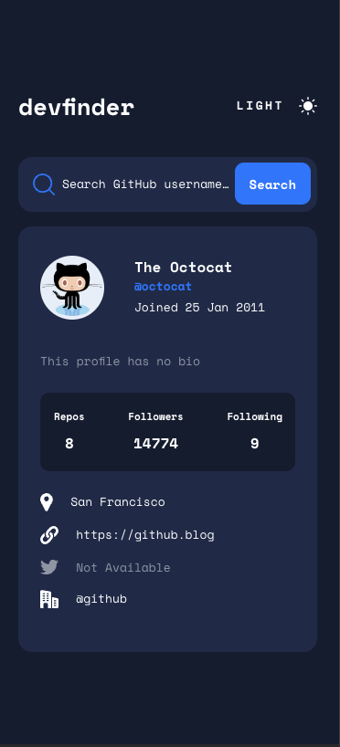

## Table of contents

- [Overview](#overview)
  - [The challenge](#the-challenge)
  - [Screenshot](#screenshot)
  - [Links](#links)
- [My process](#my-process)
  - [Built with](#built-with)
  - [What I learned](#what-i-learned)
  - [Continued development](#continued-development)
- [Author](#author)

## Overview

### The challenge

Users should be able to:

- View the optimal layout for the app depending on their device's screen size
- See hover states for all interactive elements on the page
- Search for GitHub users by their username
- See relevant user information based on their search
- Switch between light and dark themes
- **Bonus**: Have the correct color scheme chosen for them based on their computer preferences. _Hint_: Research `prefers-color-scheme` in CSS.

### Screenshot

### Links

- Solution URL: [Github repo](https://github.com/mrcordova/github-user-search-app?tab=readme-ov-file)
- Live Site URL: [Github page](https://mrcordova.github.io/github-user-search-app/)

## My process

### Built with

- Semantic HTML5 markup
- CSS custom properties
- Flexbox
- CSS Grid
- Mobile-first workflow

### What I learned

How to work with Github api.

### Continued development

I think I can use github api to showcase my github projects on my website.

## Author

- Website - [noahs.software](https://noahs.software)
- Frontend Mentor - [@mrcordova](https://www.frontendmentor.io/profile/mrcordova)
- Twitter - [@yourusername](https://www.twitter.com/yourusername)
